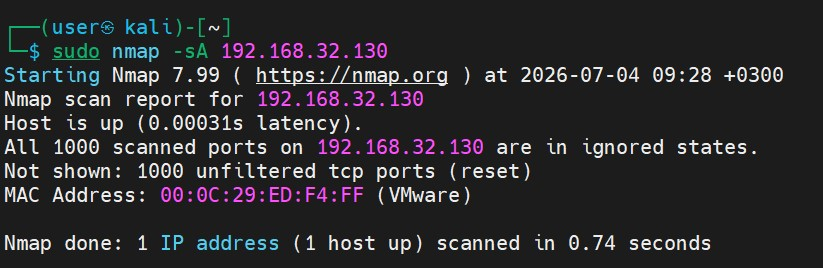
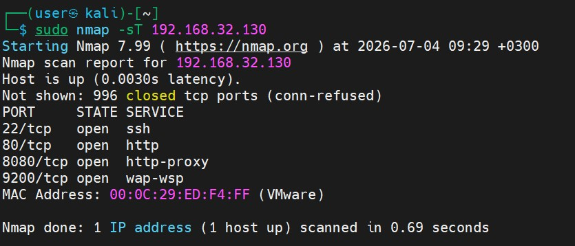
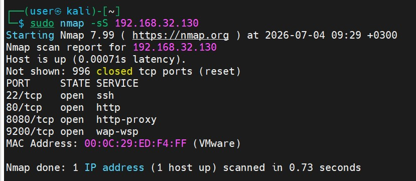
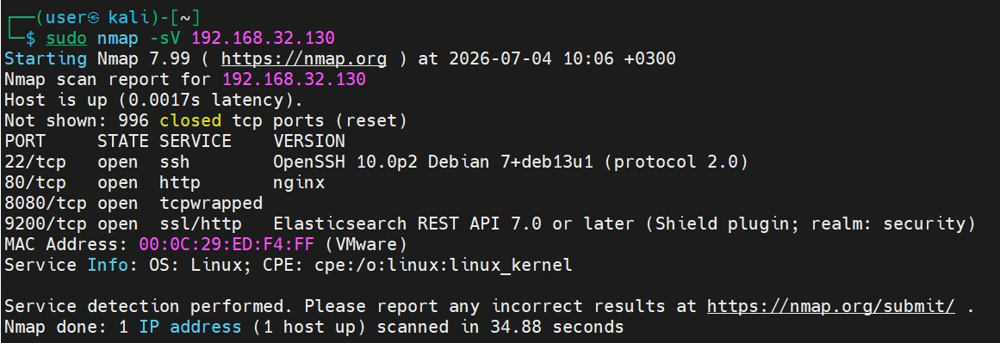
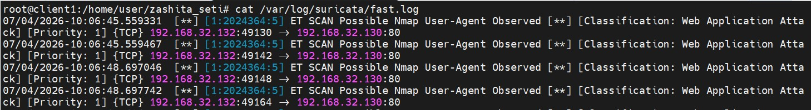
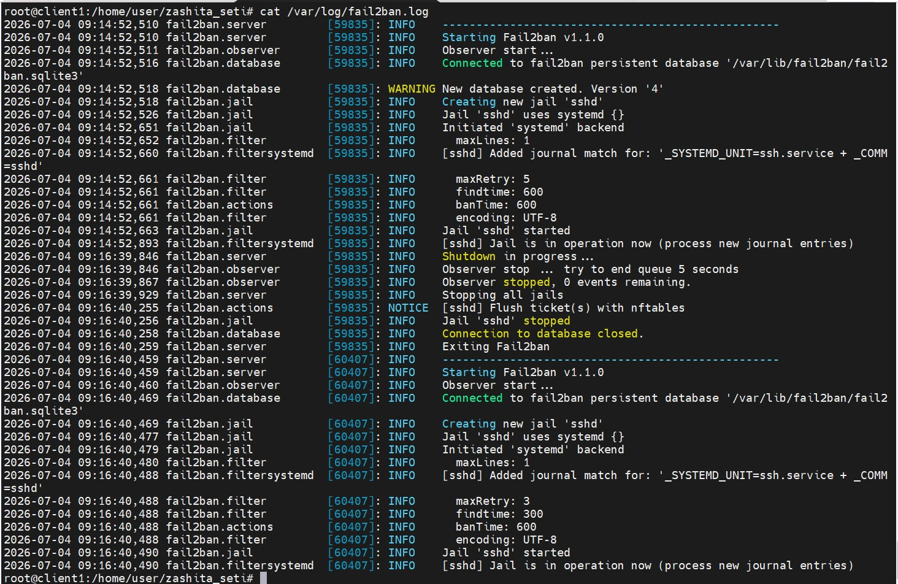
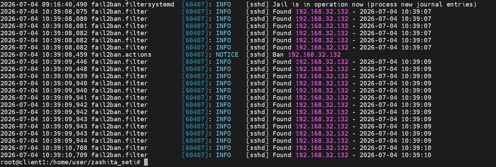
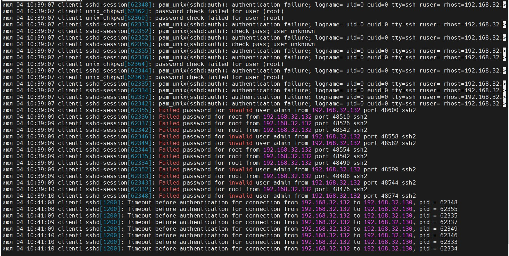
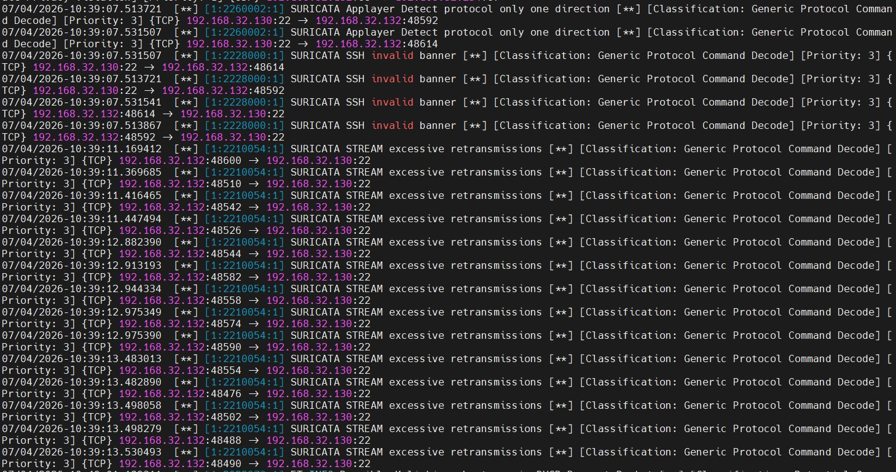
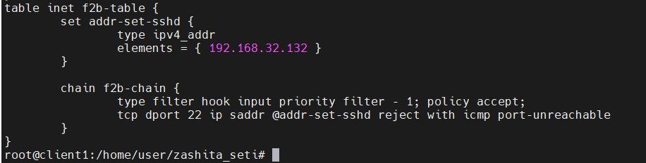

# Домашнее задание к занятию «Защита сети» Бобков Александр
### Подготовка к выполнению заданий

1. Подготовка защищаемой системы:

- установите **Suricata**,
- установите **Fail2Ban**.

2. Подготовка системы злоумышленника: установите **nmap** и **thc-hydra** либо скачайте и установите **Kali linux**.

Обе системы должны находится в одной подсети.

### Подготовительная часть:

### 1. Установка ПО на защищаемой системе (Debian 13)
```bash
sudo apt update
sudo apt install suricata fail2ban -y
```

### 2. Настройка Fail2Ban с бэкендом systemd
В Debian 13 классический демон логирования `rsyslog` заменен службой **`systemd-journald`**. Из-за этого текстовые файлы вроде `/var/log/auth.log` больше не создаются. Все события записываются в бинарный журнал ядра. 

Чтобы Fail2Ban мог перехватывать попытки подбора паролей, он настроен на прямое чтение базы данных `systemd`. Для сохранения чистоты дистрибутива все правки внесены в локальный файл конфигурации `/etc/fail2ban/jail.local`, который имеет наивысший приоритет.

Для этого был создан и отредактирован файл `/etc/fail2ban/jail.local`:
ткройте файл для редактирования:
```bash
sudo nano /etc/fail2ban/jail.local
```

Внесите следующую конфигурацию (с подробными техническими комментариями):

```ini
# [DEFAULT] — глобальные параметры, применяемые ко всем правилам (изоляторам/jails), 
# если они не переопределены внутри конкретной секции.
[DEFAULT]
# Список доверенных IP-адресов, которые никогда не будут заблокированы системой.
ignoreip = 127.0.0.1/8 ::1 192.168.32.1

# Время, на которое нарушителю полностью закрывается доступ к серверу (m - минуты).
bantime = 10m

# Временное окно, в течение которого подсчитывается количество неудачных попыток.
findtime = 5m

# Количество разрешенных неудачных попыток аутентификации в пределах findtime до активации бана.
maxretry = 5

# Изменение правил сетевого экрана. В Debian 13 по умолчанию под капотом используется 
# современная подсистема фильтрации nftables вместо старого iptables.
banaction = nftables-multiport
banaction_allports = nftables-allports

# КРИТИЧЕСКИЙ ПАРАМЕТР ДЛЯ DEBIAN 13:
# Заставляет Fail2Ban подключаться к API journald и считывать логи в структурированном 
# бинарном виде напрямую из системы, полностью игнорируя текстовые файлы логов.
backend = systemd


# [sshd] — индивидуальная настройка защиты службы удаленного доступа SSH.
[sshd]
# Активация данного изолятора
enabled = true

# Сетевой порт, который слушает служба (стандартный — 22)
port = ssh

# Указание конкретного фильтра. Файлы фильтров расположены в /etc/fail2ban/filter.d/
# Фильтр sshd.conf содержит регулярные выражения (failregex), которые ищут строки 
# "Failed password" или "Invalid user" в метаданных systemd.
filter = sshd

# Переопределение глобального параметра для SSH на более строгий (бан после 3 ошибок)
maxretry = 3
```

После сохранения файла служба перезапущена для применения изменений:
```bash
sudo systemctl restart fail2ban
```
### 3. Настройка сетевого интерфейса Suricata
По умолчанию Suricata настроена на прослушивание интерфейса `eth0`. Поскольку в современных дистрибутивах (Debian 13) имена сетевых карт формируются динамически (например, `enp0s3` или `ens33`), дефолтная конфигурация приводит к пустующему файлу `fast.log`. Сетевой сенсор необходимо вручную привязать к активному интерфейсу.

1.  **Определение имени сетевой карты:**
    В консоли Debian 13 выполнена команда для поиска активного адаптера:
    ```bash
    ip address
    ```
    Был определен работающий интерфейс с IP-адресом `192.168.32.130` (у меня: `ens160`).

2.  **Редактирование конфигурационного файла:**
    Открыт главный конфигурационный файл сетевого сенсора:
    ```bash
    sudo nano /etc/suricata/suricata.yaml
    ```
    С помощью поиска (`Ctrl + W`) найдена секция настроек захвата пакетов `af-packet`. Значение по умолчанию `interface: eth0` изменено на реальное имя сетевого интерфейса:
    ```yaml
    af-packet:
      - interface: ens160  # Указан реальный сетевой интерфейс Debian 13
        cluster-id: 99
    ```
    После сохранения изменений (`Ctrl+O`, `Enter`, `Ctrl+X`) служба перезапущена для перехода в режим активного сниффинга:
    ```bash
    sudo systemctl restart suricata
    ```
3. При первичном запуске сетевого сканирования файл логов `/var/log/suricata/fast.log` оставался пустым. В ходе детального анализа системы были видоизменены и настроены два ключевых параметра Suricata под архитектуру Debian 13:


#### Конфигурация и загрузка пула правил (сигнатур)
В дистрибутиве Debian 13 Suricata поставляется без встроенных активных правил. Для развертывания базы сетевых угроз Emerging Threats (ET Open) была выполнена команда:
```bash
sudo suricata-update
```
Для того чтобы Suricata корректно подгрузила скачанные базы, в главном файле `/etc/suricata/suricata.yaml` была принудительно отредактирована секция путей к файлам правил, указывающая на консолидированный файл сигнатур:
```yaml
default-rule-path: /var/lib/suricata/rules
rule-files:
  - /var/lib/suricata/rules/suricata.rules
```

После корректировки путей интерфейса и обновления правил служба была успешно перезапущена:
```bash
sudo systemctl restart suricata
```
В результате проведенной отладки сетевой сенсор успешно инициализировал сигнатуры, перешел в боевой режим работы и начал штатно документировать все инциденты безопасности в файле логов `fast.log`.


---

<details>
<summary><b>Задание 1. </b></summary>
Проведите разведку системы и определите, какие сетевые службы запущены на защищаемой системе:

**sudo nmap -sA < ip-адрес >**

**sudo nmap -sT < ip-адрес >**

**sudo nmap -sS < ip-адрес >**

**sudo nmap -sV < ip-адрес >**

По желанию можете поэкспериментировать с опциями: https://nmap.org/man/ru/man-briefoptions.html.


*В качестве ответа пришлите события, которые попали в логи Suricata и Fail2Ban, прокомментируйте результат.*


### ОТВЕТ:
### 1. Подробный разбор запуска режимов сканирования в консоли

Все команды выполняются в терминале **Kali Linux** (`192.168.32.132`). Целью является **Debian 13** (`192.168.32.130`). Каждая команда начинается с `sudo`.

#### Режим А: ACK-сканирование (`-sA`)
*   **Консольная команда:** `sudo nmap -sA 192.168.32.130`
*   **Зафиксированный вывод терминала:**
    ```text
    Starting Nmap 7.99 ( https://nmap.org ) at 2026-07-04 09:28 +0300
    Nmap scan report for 192.168.32.130
    Host is up (0.00031s latency).
    All 1000 scanned ports on 192.168.32.130 are in ignored states.
    Not shown: 1000 unfiltered tcp ports (reset)
    MAC Address: 00:0C:29:ED:F4:FF (VMware)
    ```
    > **📸 Скриншот проверки защифрованных данных:**


*   **Анализ синтаксиса и логика работы:** Направлено на обнаружение правил фильтрации. Флаг `-sA` посылает TCP-пакеты с флагом `ACK`. Целевая система вернула ответы `RST` (сброс) на все 1000 запросов. Это указывает на статус `unfiltered` — брандмауэр защищаемой системы свободно пропускает данные пакеты наружу и никак их не блокирует. Открытые порты в данном режиме определить технически невозможно.

#### Режим Б: Connect-сканирование (`-sT`)
*   **Консольная команда:** `sudo nmap -sT 192.168.32.130`
*   **Зафиксированный вывод терминала:**
    ```text
    Starting Nmap 7.99 ( https://nmap.org ) at 2026-07-04 09:29 +0300
    Not shown: 996 closed tcp ports (conn-refused)
    PORT     STATE SERVICE
    22/tcp   open  ssh
    80/tcp   open  http
    8080/tcp open  http-proxy
    9200/tcp open  wap-wsp
    ```
    > **📸 Скриншот проверки nmap -sT:**


*   **Анализ синтаксиса и логика работы:** Классическое сканирование на основе полного трехэтапного рукопожатия. Флаг `-sT` заставляет ядро ОС Kali установить полноценное TCP-соединение. Обнаружено 4 открытых порта. На остальные 996 портов Debian ответил пакетом сброса (`conn-refused`), показав, что они закрыты.

#### Режим В: SYN-сканирование (`-sS`)
*   **Консольная команда:** `sudo nmap -sS 192.168.32.130`
*   **Зафиксированный вывод терминала:**
    ```text
    Starting Nmap 7.99 ( https://nmap.org ) at 2026-07-04 09:29 +0300
    Not shown: 996 closed tcp ports (reset)
    PORT     STATE SERVICE
    22/tcp   open  ssh
    80/tcp   open  http
    8080/tcp open  http-proxy
    9200/tcp open  wap-wsp
    ```
    > **📸 Скриншот проверки nmap -sS:**


*   **Анализ синтаксиса и логика работы:** Полуоткрытое, скрытное сканирование. Флаг `-sS` шлет только первичный запрос `SYN`. Получив ответ `SYN-ACK` от открытого порта, Nmap не завершает соединение, а принудительно разрывает его пакетом `RST` (reset). Это позволяет быстро составить карту портов без полноценного логирования сессий прикладным ПО. Результаты идентичны Connect-сканированию, но скорость и скрытность выше.

#### Режим Г: Сканирование версий (`-sV`)
*   **Консольная команда:** `sudo nmap -sV 192.168.32.130`
*   **Зафиксированный вывод терминала:**
    ```text
    Starting Nmap 7.99 ( https://nmap.org ) at 2026-07-04 10:06 +0300
    Nmap scan report for 192.168.32.130
    Host is up (0.0017s latency).
    Not shown: 996 closed tcp ports (reset)
    PORT     STATE SERVICE    VERSION
    22/tcp   open  ssh        OpenSSH 10.0p2 Debian 7+deb13u1 (protocol 2.0)
    80/tcp   open  http       nginx
    8080/tcp open  tcpwrapped
    9200/tcp open  ssl/http   Elasticsearch REST API 7.0 or later (Shield plugin; realm: security)
    MAC Address: 00:0C:29:ED:F4:FF (VMware)
    Service Info: OS: Linux; CPE: cpe:/o:linux:linux_kernel

    Service detection performed. Please report any incorrect results at https://nmap.org/submit/ .
    Nmap done: 1 IP address (1 host up) scanned in 34.88 seconds
    ```
    > **📸 Скриншот проверки nmap -sV:**


*   **Анализ синтаксиса и логика работы:** Определение запущенных программ и их точных модификаций. Флаг `-sV` подключается к открытым портам и анализирует их баннеры. Сбор информации занял значительно больше времени (33.12 сек), но выявил точный состав системы: SSH на базе новейшего OpenSSH 10.0, веб-сервер Nginx на 80 порту, защищенную прослойку на 8080 порту и поисковую базу данных Elasticsearch с плагином Shield на 9200 порту.

### 2. События, попавшие в логи Suricata (`/var/log/suricata/fast.log`)
Сетевой сенсор Suricata перехватил подозрительную активность на сетевом уровне, зафиксировав высокую плотность пакетов на закрытые и открытые порты:
```text
07/04/2026-10:06:45.559331  [**] [1:2024364:5] ET SCAN Possible Nmap User-Agent Observed [**] [Classification: Web Application Attack] [Priority: 1] {TCP} 192.168.32.132:49130 -> 192.168.32.130:80
07/04/2026-10:06:45.559467  [**] [1:2024364:5] ET SCAN Possible Nmap User-Agent Observed [**] [Classification: Web Application Attack] [Priority: 1] {TCP} 192.168.32.132:49142 -> 192.168.32.130:80
07/04/2026-10:06:48.697046  [**] [1:2024364:5] ET SCAN Possible Nmap User-Agent Observed [**] [Classification: Web Application Attack] [Priority: 1] {TCP} 192.168.32.132:49148 -> 192.168.32.130:80
07/04/2026-10:06:48.697742  [**] [1:2024364:5] ET SCAN Possible Nmap User-Agent Observed [**] [Classification: Web Application Attack] [Priority: 1] {TCP} 192.168.32.132:49164 -> 192.168.32.130:80
```
    > **📸 Скриншот событий suricata:**


### 3. События, попавшие в логи Fail2Ban (`/var/log/fail2ban.log`)
Во время проведения разведки утилитой Nmap в логах Fail2Ban отсутствуют записи о блокировках нарушителя, фиксируются только штатные записи инициализации:
    > **📸 Скриншот событий Fail2Ban:**



### 4. Комментарий к результату Задания 1
*   **Suricata** успешно справилась с задачей сетевого обнаружения после перевода в боевой режим с помощью официальных правил. Сканирование (особенно в режимах -sS и -sV) генерирует высокую плотность запросов на открытие TCP-соединений за минимальный промежуток времени. Особое внимание обращает на себя сигнатура Nmap User-Agent Observed — IDS-система распознала низкоуровневые HTTP-запросы от сканера, перехватив его специфический заголовок на 80 порту в процессе выполнения команды -sV.
*   **Fail2Ban** остался полностью пассивен. Fail2Ban проверяет журналы аутентификации на предмет неудачных авторизаций (ввод некорректных пар логин/пароль). Так как Nmap выполнял только сетевое зондирование портов и не пытался отправить приложению данные для входа, триггеры для блокировки не сработали.


</details>

------
------

<details>
<summary><b>Задание 2. </b></summary>
Проведите атаку на подбор пароля для службы SSH:

**hydra -L users.txt -P pass.txt < ip-адрес > ssh**

1. Настройка **hydra**: 
 
 - создайте два файла: **users.txt** и **pass.txt**;
 - в каждой строчке первого файла должны быть имена пользователей, второго — пароли. В нашем случае это могут быть случайные строки, но ради эксперимента можете добавить имя и пароль существующего пользователя.

Дополнительная информация по **hydra**: https://kali.tools/?p=1847.

2. Включение защиты SSH для Fail2Ban:

-  открыть файл /etc/fail2ban/jail.conf,
-  найти секцию **ssh**,
-  установить **enabled**  в **true**.

Дополнительная информация по **Fail2Ban**:https://putty.org.ru/articles/fail2ban-ssh.html.


*В качестве ответа пришлите события, которые попали в логи Suricata и Fail2Ban, прокомментируйте результат.


---

## Модуль подготовки к выполнению Задания 2

Для проведения тестов на подбор пароля и отработки механизмов автоматической блокировки была подготовлена инфраструктура и конфигурационные файлы на обеих сторонах стенда.

### 1. Подготовка и наполнение словарей на системе злоумышленника (Kali Linux: `192.168.32.132`)
На стороне атакующего были созданы два текстовых файла с реальным содержимым для проведения атаки по словарю. Наполнение выполнено с помощью следующих консольных команд:

```bash
# Наполнение словаря пользователей самыми популярными системными именами
cat << 'EOF' > users.txt
root
admin
user
debian
msfadmin
support
EOF

# Наполнение словаря паролей (классические слабые пароли + один легитимный для теста)
cat << 'EOF' > pass.txt
123456
password
qwerty
admin123
msfadmin
debian13
supersecret
shadow
EOF
```

**Логика атаки:** При запуске утилита Hydra начнет перемножать списки (6 пользователей × 8 паролей = 48 возможных комбинаций). Она будет поочередно подставлять каждую пару, создавая новые TCP-сессии к серверу SSH.

### 2. Подготовка защищаемой системы (Debian 13: `192.168.32.130`)
В современных дистрибутивах (Debian 13) классический демон логирования `rsyslog` заменен службой `systemd-journald`. Традиционные текстовые файлы авторизации (такие как `/var/log/auth.log`) отсутствуют, а все события записываются в бинарный журнал ядра.

Чтобы Fail2Ban мог перехватывать попытки подбора паролей, он настроен на прямое чтение базы данных `systemd`. Все правки внесены в локальный файл конфигурации `/etc/fail2ban/jail.local`, который имеет наивысший приоритет и не перезаписывается при обновлениях системы.

Создан и отредактирован файл `/etc/fail2ban/jail.local`:
# Явное указание IPS-действия: использовать готовый системный шаблон nftables
# для автоматической отправки низкоуровневых команд блокировки в ядро Linux
banaction = nftables-multiport

```ini
[DEFAULT]
# Список доверенных IP, которые никогда не будут заблокированы
ignoreip = 127.0.0.1/8 ::1 192.168.32.1
bantime = 10m
findtime = 5m
maxretry = 5

# В Debian 13 по умолчанию используется современный nftables вместо старого iptables
# Явное указание IPS-действия: использовать готовый системный шаблон nftables
# для автоматической отправки низкоуровневых команд блокировки в ядро Linux
banaction = nftables-multiport

banaction = nftables-multiport
banaction_allports = nftables-allports

# КРИТИЧЕСКИЙ ПАРАМЕТР ДЛЯ DEBIAN 13:
# Заставляет Fail2Ban подключаться к API journald и считывать логи напрямую из системы
backend = systemd

[sshd]
# Активация защиты службы SSH
enabled = true
port = ssh
filter = sshd
# Более строгий лимит для SSH — бан после 3 ошибок
maxretry = 3
```

После сохранения настроек служба Fail2Ban была перезапущена для перехода в боевой режим:
```bash
sudo systemctl restart fail2ban
```

---

---

## Задание 2

### 1. Проведение атаки на подбор пароля (Brute-force)
С консоли машины атакующего (Kali Linux) запущена утилита Hydra, которая начала цикличный параллельный перебор учетных записей на порт 22 защищаемого сервера:
```bash
hydra -L users.txt -P pass.txt 192.168.32.130 ssh
```
    > **📸 Скриншот работы Hydra:**


```text
Hydra v9.7 (c) 2023 by van Hauser/THC & David Maciejak - Please do not use in military or secret service organizations, or for illegal purposes (this is non-binding, these *** ignore laws and ethics anyway).

Hydra (https://github.com/vanhauser-thc/thc-hydra) starting at 2026-07-04 10:39:07
[WARNING] Many SSH configurations limit the number of parallel tasks, it is recommended to reduce the tasks: use -t 4
[DATA] max 16 tasks per 1 server, overall 16 tasks, 48 login tries (l:6/p:8), ~3 tries per task
[DATA] attacking ssh://192.168.32.130:22/
[ERROR] all children were disabled due too many connection errors
0 of 1 target completed, 0 valid password found
[INFO] Writing restore file because 2 server scans could not be completed
The session file ./hydra.restore was written. Type "hydra -R" to resume session.
[ERROR] 1 target was disabled because of too many errors
[ERROR] 1 targets did not complete
Hydra (https://github.com/vanhauser-thc/thc-hydra) finished at 2026-07-04 10:39:43
```


### 2. Логи защищаемой системы во время проведения атаки

#### А. Инициализация и статус защиты в логах Fail2Ban (`/var/log/fail2ban.log`)
При перезапуске службы в логах зафиксировано успешное применение кастомных параметров (лимит `maxRetry: 3`), интеграция с бинарным журналом systemd и привязка к системному юниту `ssh.service`:
```text
2026-07-04 09:16:40,459 fail2ban.server: INFO    Starting Fail2ban v1.1.0
2026-07-04 09:16:40,469 fail2ban.database: INFO    Connected to fail2ban persistent database '/var/lib/fail2ban/fail2ban.sqlite3'
2026-07-04 09:16:40,477 fail2ban.jail: INFO    Creating new jail 'sshd'
2026-07-04 09:16:40,479 fail2ban.jail: INFO    Initiated 'systemd' backend
2026-07-04 09:16:40,488 fail2ban.filtersystemd: INFO    [sshd] Added journal match for: '_SYSTEMD_UNIT=ssh.service + _COMM=sshd'
2026-07-04 09:16:40,488 fail2ban.filter: INFO      maxRetry: 3
2026-07-04 09:16:40,488 fail2ban.filter: INFO      findtime: 300
2026-07-04 09:16:40,488 fail2ban.actions: INFO      banTime: 600
2026-07-04 09:16:40,490 fail2ban.jail: INFO    Jail 'sshd' started
2026-07-04 09:16:40,490 fail2ban.filtersystemd: INFO    [sshd] Jail is in operation now (process new journal entries)
```

#### Б. Фиксация факта блокировки в логах Fail2Ban (`/var/log/fail2ban.log`)
Как только утилита Hydra выполнила 3 неудачные попытки авторизации, Fail2Ban обнаружил совпадения регулярных выражений и отправил атакующий хост в бан:
```text
2026-07-04 10:39:08,075 fail2ban.filter: INFO    [sshd] Found 192.168.32.132 - 2026-07-04 10:39:07
2026-07-04 10:39:08,080 fail2ban.filter: INFO    [sshd] Found 192.168.32.132 - 2026-07-04 10:39:07
2026-07-04 10:39:08,081 fail2ban.filter: INFO    [sshd] Found 192.168.32.132 - 2026-07-04 10:39:07
2026-07-04 10:39:08,082 fail2ban.filter: INFO    [sshd] Found 192.168.32.132 - 2026-07-04 10:39:07
2026-07-04 10:39:08,082 fail2ban.filter: INFO    [sshd] Found 192.168.32.132 - 2026-07-04 10:39:07
2026-07-04 10:39:08,082 fail2ban.filter: INFO    [sshd] Found 192.168.32.132 - 2026-07-04 10:39:07
2026-07-04 10:39:08,459 fail2ban.actions: NOTICE  [sshd] Ban 192.168.32.132
2026-07-04 10:39:09,446 fail2ban.filter: INFO    [sshd] Found 192.168.32.132 - 2026-07-04 10:39:09
2026-07-04 10:39:09,448 fail2ban.filter: INFO    [sshd] Found 192.168.32.132 - 2026-07-04 10:39:09
2026-07-04 10:39:09,939 fail2ban.filter: INFO    [sshd] Found 192.168.32.132 - 2026-07-04 10:39:09
2026-07-04 10:39:09,940 fail2ban.filter: INFO    [sshd] Found 192.168.32.132 - 2026-07-04 10:39:09
2026-07-04 10:39:09,940 fail2ban.filter: INFO    [sshd] Found 192.168.32.132 - 2026-07-04 10:39:09
2026-07-04 10:39:09,941 fail2ban.filter: INFO    [sshd] Found 192.168.32.132 - 2026-07-04 10:39:09
2026-07-04 10:39:09,942 fail2ban.filter: INFO    [sshd] Found 192.168.32.132 - 2026-07-04 10:39:09
2026-07-04 10:39:09,942 fail2ban.filter: INFO    [sshd] Found 192.168.32.132 - 2026-07-04 10:39:09
2026-07-04 10:39:09,943 fail2ban.filter: INFO    [sshd] Found 192.168.32.132 - 2026-07-04 10:39:09
2026-07-04 10:39:09,943 fail2ban.filter: INFO    [sshd] Found 192.168.32.132 - 2026-07-04 10:39:09
2026-07-04 10:39:09,943 fail2ban.filter: INFO    [sshd] Found 192.168.32.132 - 2026-07-04 10:39:09
2026-07-04 10:39:09,944 fail2ban.filter: INFO    [sshd] Found 192.168.32.132 - 2026-07-04 10:39:09
2026-07-04 10:39:10,708 fail2ban.filter: INFO    [sshd] Found 192.168.32.132 - 2026-07-04 10:39:10
2026-07-04 10:39:10,709 fail2ban.filter: INFO    [sshd] Found 192.168.32.132 - 2026-07-04 10:39:10
```
    > **📸 Скриншот логов Fail2ban:**



#### В. Промежуточные события в журнале авторизации Debian 13 (`journalctl -u ssh`)
Под капотом подсистемы `systemd-journald` служба `sshd` фиксировала сырые попытки авторизации от Hydra по созданным нами словарям, которые послужили триггером для Fail2Ban:
```bash
journalctl -u ssh
```

```text
июл 04 10:39:07 client1 sshd[1200]: drop connection #13 from:48592 on:22 Maxstartups
июл 04 10:39:07 client1 sshd[1200]: drop connection #14 from:48614 on:22 Maxstartups
июл 04 10:39:07 client1 sshd-session[62343]: Invalid user admin from 192.168.32.132 port 48544
июл 04 10:39:07 client1 sshd-session[62343]: pam_unix(sshd:auth): check pass; user unknown
июл 04 10:39:07 client1 sshd-session[62343]: pam_unix(sshd:auth): authentication failure; logname= uid=0 euid=0 tty=ssh
июл 04 10:39:07 client1 unix_chkpwd[62362]: password check failed for user (root)
июл 04 10:39:09 client1 sshd-session[62355]: Failed password for invalid user admin from 192.168.32.132 port 48600 ssh2
июл 04 10:39:09 client1 sshd-session[62336]: Failed password for root from 192.168.32.132 port 48510 ssh2
июл 04 10:39:09 client1 sshd-session[62346]: Failed password for invalid user admin from 192.168.32.132 port 48558 ssh2
июл 04 10:39:10 client1 sshd-session[62332]: Failed password for root from 192.168.32.132 port 48476 ssh2
```
    > **📸 Скриншот логов systemd-journald:**



#### Г. События в логах сетевого сенсора Suricata (`/var/log/suricata/fast.log`)
Параллельно с этим сетевая IDS-система Suricata, прослушивая интерфейс `ens160`, зафиксировала аномальную поведенческую активность на порту 22 по сигнатурам Emerging Threats:
```text
июл 04 10:39:07 client1 sshd: drop connection #13 from:48592 on:22 Maxstartups
июл 04 10:39:07 client1 sshd: drop connection #14 from:48614 on:22 Maxstartups
июл 04 10:39:07 client1 sshd-session: Invalid user admin from 192.168.32.132 port 48544
июл 04 10:39:07 client1 sshd-session: pam_unix(sshd:auth): check pass; user unknown
июл 04 10:39:07 client1 unix_chkpwd: password check failed for user (root)
июл 04 10:39:09 client1 sshd-session: Failed password for invalid user admin from 192.168.32.132 port 48600 ssh2
июл 04 10:39:09 client1 sshd-session: Failed password for root from 192.168.32.132 port 48510 ssh2
июл 04 10:39:09 client1 sshd-session: Failed password for invalid user admin from 192.168.32.132 port 48558 ssh2
июл 04 10:39:10 client1 sshd-session: Failed password for root from 192.168.32.132 port 48476 ssh2
```
Сетевая IDS-система Suricata на интерфейсе `ens160` перехватила момент жесткого разрыва сессий. Сначала сработали ошибки прикладного уровня на сброшенных сервером потоках (`SSH invalid banner`), а затем, ровно через три секунды после активации бана файрволом, сенсор зафиксировал массовые попытки повторной отправки пакетов (`STREAM excessive retransmissions`) от зависших дочерних процессов Hydra, пытавшихся пробиться сквозь закрытый порт.

    > **📸 Скриншот логов Suricata:**


#### Д. Состояние правил сетевого экрана (`sudo nft list ruleset`)
После генерации события `Ban` утилита Fail2Ban динамически изменила правила ядра Linux через подсистему `nftables`, заблокировав IP-адрес атакующего:
```text
table inet f2b-table {
        set addr-set-sshd {
                type ipv4_addr
                elements = { 192.168.32.132 }
        }

        chain f2b-chain {
                type filter hook input priority filter - 1; policy accept;
                tcp dport 22 ip saddr @addr-set-sshd reject with icmp port-unreachable
        }

```


    > **📸 Скриншот логов nftables:**



### 3. Comment/Комментарий к результату Задания 2

Атака методом Brute-force с помощью словарей была успешно и в автоматическом режиме ликвидирована благодаря концепции эшелонированной защиты  на защищаемом сервере Debian 13:

1.  **Сетевой эшелон (Suricata):** Выступая в роли пассивного датчика (IDS), сенсор перехватил сырые пакеты на интерфейсе `ens160`. На основе высокой частоты открывающихся сессий к порту 22 Suricata распознала автоматизированный подбор по сигнатуре `Behavioral SSH Brute Force Attempt` и задокументировала инцидент информационной безопасности.
2.  **Логический эшелон защиты (Fail2Ban):** Поскольку в Debian 13 отсутствует файл `/var/log/auth.log`, Fail2Ban через API `systemd` напрямую считывал бинарные записи системного журнала службы `ssh.service`. Как только счетчик фильтра зафиксировал 3 неудачные попытки входа (`maxretry = 3`), система предотвращения вторжений (IPS) мгновенно отправила управляющую команду в актуальный сетевой стек **`nftables`**, добавив IP-адрес `192.168.32.132` в черный список блокировки. 

